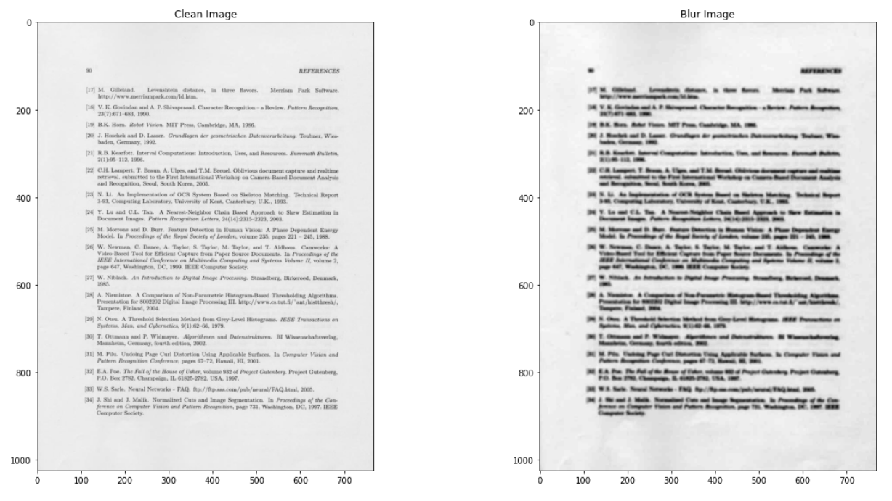
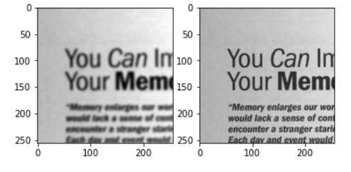
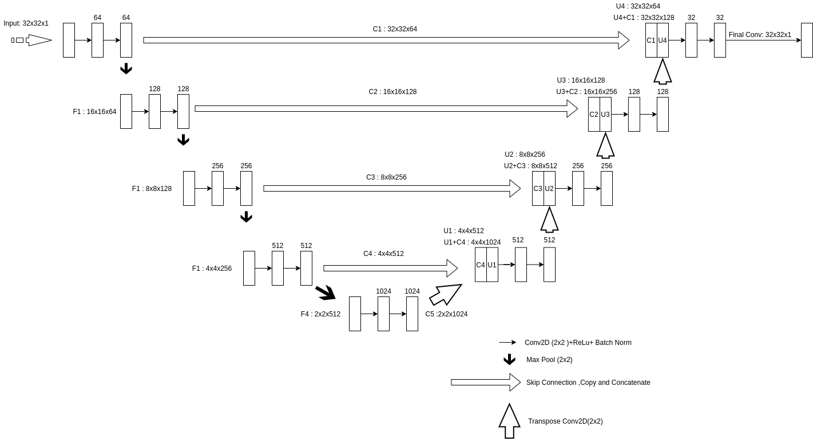
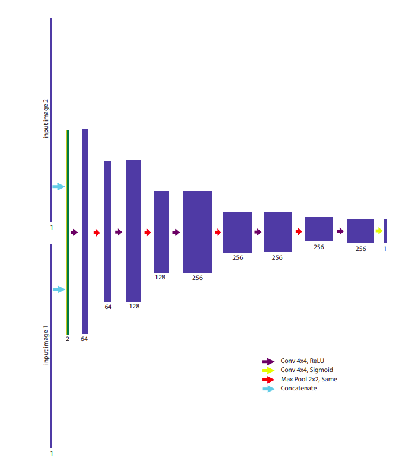
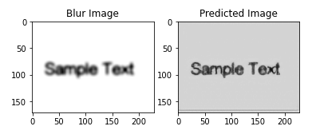

# DE-GAN-Implementation-Using-PyTorch
Document Enhancement Generative Adversarial Networks

This Implementation is based on https://arxiv.org/abs/2010.08764 

# 1. Introduction

  This problem is considered as image to image translation task where the goal is to generate a clean
image given an input of degraded image. The model has two network which is the generator and the
Discriminator. The generator will have input of random noise vector and the objective is to map this
noise vector to an image while the discriminator will have two input which is the image generated by
the generator and the ground truth image. The goal of discriminator is to predict which of these two
image is fake. Both network will compete each other to win. Discriminator will improve its prediction
of the image being fake and the generator will improve to generate an image similar to the ground
truth.

# 1. Objective

Given a degraded/blur text image as input to the trained GAN model, a enhanced/clean image is produced.

 # 2. Training Dataset
The dataset contains written documents and patches is created by cropping/zooming certain parts of
the documents.

* Dataset
 

* After patches are created

# 3. Architecture
* Generator

  
  The generator model consist of sequence of convolutional layers and transpose convolutional layers.
  Convolutional layers perform downsampling until certain layer. Then, the process is reversed in transpose convolutional layer where a sequence of layers perform upsampling. This process is called encoderdecoder and it has its disadvantage which is:

  1. During convolution process, information is lost, thus affecting the transpose convolutional process
  and the model will have hard time to generalise the data.
  2. Feature maps of input and output share huge amount of pixel which is unwanted information. It
  is a waste of time and computational power.

  Due to this reasons, skip connections are added where it will copy and concatenate output from
  the encoder to decoder to randomise the data and prevent gradient vanishing problems. Some batch
  normalization layers are added to ease the training of the model.
 
* Discriminator

  The discriminator contains Fully convolutional network composed of 6 convolutional layers .Discriminator take two inputs which is the generated input from    
  generator network and the ground truth
  image. The two image is then concatenated together in a 256x25x2 shape tensor and the output is
  16 x 16 x 1 matrix in the last layer. This matrix contains the probability of predicting which one is
  fake. If the probability is close to 1, it will predict the clean image as the ground truth and if it is 0,
  It will predict the generated image as the ground truth. During training , The produced images are
  fed to the discriminator with the ground truth patches and the degraded ones .After the training the
  discriminator is no longer used for inference.
 
# 4. Training
The model is trained using GTX 1050 2GB memory GPU power. The number of epochs used for this
model is 150. The learning rate is 0.0002. Due to resource power, I had to train for 150 epochs which I
considered is low for the model to be well trained. I have observed the loss was still decreasing during
the 150th epoch and has potential to predict better if it is trained for high number of epochs.

# 5. Inference

